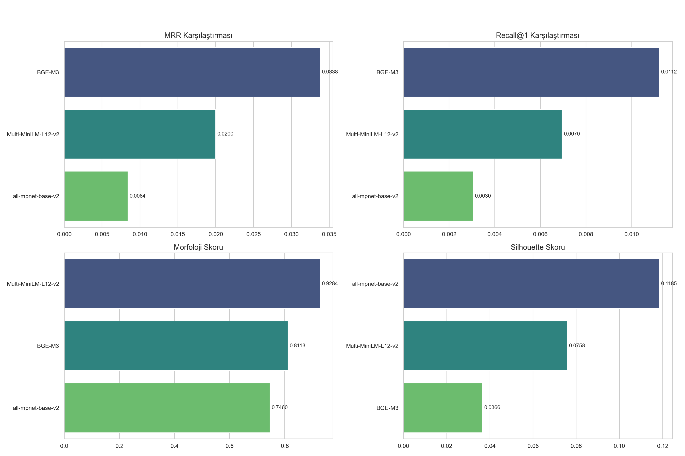
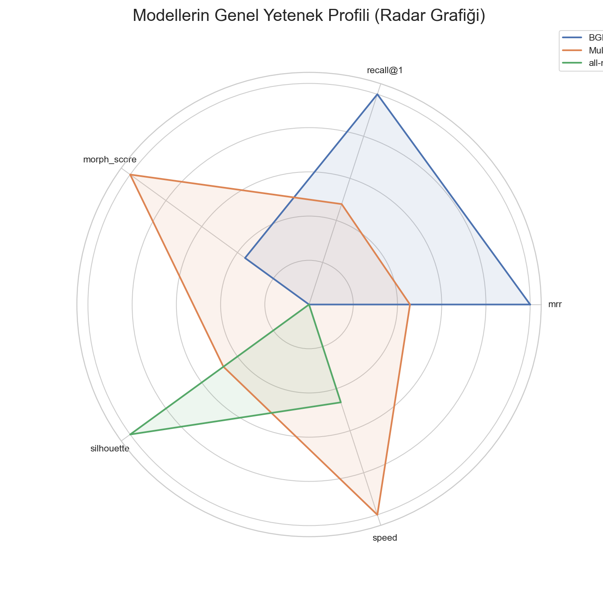

# embedding_compare

# Türkçe Tıbbi Metinler İçin En İyi Embedding Modeli Hangisi?

## 3 popüler modeli MedTurkQuaD veri setiyle test ettim. En hızlı model her zaman en iyi değilmiş — işte kanıtı.

---


---

**⏱️ Okuma Süresi:** 10 dakika | **🔧 Seviye:** Orta | **💻 Kod:** Dahil  
**👤 Yazar:** [İsminiz] | **📅 Tarih:** [Tarih]

---

## 📌 TL;DR (Hızlı Özet)

> 3 popüler embedding modelini (Multi-MiniLM, BGE-M3, all-mpnet) Türkçe tıbbi soru-cevap veri setiyle karşılaştırdım. **Sonuçlar şaşırtıcı:**
> 
> - 🏆 **BGE-M3:** En iyi retrieval (MRR: 0.0338) ama en yavaş (50.59 sn)
> - ⚡ **Multi-MiniLM:** En hızlı (15.81 sn) ve Türkçe morfolojisinde şampiyon (0.9284)
> - 🚫 **all-mpnet:** İngilizce'de harika ama Türkçe'de fiyasko (MRR: 0.0084)
> 
> **Ana ders:** "Multilingual" etiketi yeterli değil. Domain-specific test şart!

---

## 🎭 Hikaye: Neden Bu Teste İhtiyacım Oldu?

Geçen ay bir tıbbi soru-cevap sistemi geliştiriyordum. HuggingFace'te en popüler embedding modellerini denedim. Sonuçlar... felaketti.

"Apse nedir?" sorusuna sistem "akciğer kanseri" cevabını veriyordu. Modeli değiştirdim, biraz daha iyi oldu ama yine de tatmin edici değildi. 

O zaman şunu anladım: **Benchmark tabloları İngilizce için geçerli. Türkçe + Tıp kombinasyonu için hiçbir veri yoktu.**

Bu yazıda, **sistematik bir karşılaştırma** yaparak hangi modelin gerçekten işe yaradığını göstereceğim.

---

## 🎯 Bu Karşılaştırma Neden Önemli?

### Embedding Modeli Seçerken Yaşanan Tipik Sorunlar

❌ **"En popüler modeli seçeyim"** → Popülerlik ≠ Senin use case'in için uygun  
❌ **"Multilingual yazıyor, Türkçe destekler"** → Teoride evet, pratikte bazen hayır  
❌ **"Benchmark'ta 1. sırada"** → Hangi dilde? Hangi domain'de?  
❌ **"En büyük model en iyisidir"** → Daha yavaş, daha pahalı, her zaman daha iyi değil

### Bu Testin Farkı

✅ **Aynı veri seti** → Adil karşılaştırma  
✅ **Aynı metrikler** → Objektif değerlendirme  
✅ **Tekrarlanabilir kod** → Sen de deneyebilirsin  
✅ **Türkçe + Domain-specific** → Gerçek dünya senaryosu

---

## 🔬 Test Düzeneği

### Yarışmaya Katılan Modeller

| Model | Boyut | Özellik | Beklenti |
|-------|-------|---------|----------|
| **Multi-MiniLM-L12-v2** | 384 | Hafif, çok dilli | Hızlı ama yeterli mi? |
| **BGE-M3** | 1024 | Yeni nesil, güçlü | En iyi ama ne kadar yavaş? |
| **all-mpnet-base-v2** | 768 | İngilizce SOTA | Türkçe'de ne olacak? |

### Test Arenası: MedTurkQuaD Veri Seti

**Ne?** Türkçe tıbbi soru-cevap veri seti  
**Neden zor?** İki katmanlı zorluk:
1. 🇹🇷 **Türkçe morfolojisi** (ekler, çekim)
2. 🏥 **Tıbbi terminoloji** (domain-specific)

**Örnek Zorluk:**

```
Soru: "Apse genellikle neyin neden olduğu bir yangı türüdür?"

✅ Doğru: "piyojen bakterilerin"
❌ Yanıltıcı Negatif: "akciğer dokularındaki hücrelerin kontrolsüz..."

→ Her iki cevap da tıbbi terim içeriyor!
→ Model ince ayrımları yakalayabilmeli
```

### Tekrarlanabilirlik Garantisi

```python
# Her çalıştırmada aynı sonuç
device = "cuda" if torch.cuda.is_available() else "cpu"
random.seed(42)
np.random.seed(42)
torch.manual_seed(42)
if torch.cuda.is_available():
    torch.cuda.manual_seed_all(42)
```

**Neden 42?** Evrenin, yaşamın ve her şeyin cevabı 😉 (ve AI topluluğunun standart seed'i)

---

## 📊 Test Süreci: Adım Adım

### Adım 1: Veri Hazırlığı - Negative Sampling

```python
def process_qa_data(qa_data):
    all_queries, all_positives, all_negatives = [], [], []
    
    # Sorular ve doğru cevaplar
    for doc in qa_data.get('data', []):
        for paragraph in doc.get('paragraphs', []):
            for qa_pair in paragraph.get('qas', []):
                all_queries.append(qa_pair['question'])
                all_positives.append(qa_pair['answers'][0]['text'])
    
    # Her pozitif için rastgele bir negative
    num_pairs = len(all_positives)
    for i in range(num_pairs):
        idx = i
        while idx == i:  # Aynı cevabı alma
            idx = random.choice(range(num_pairs))
        all_negatives.append(all_positives[idx])
    
    return all_queries, all_positives, all_negatives
```

**Neden bu yöntem?**
- Gerçek dünyada da doğru cevap yanlışlar arasında kaybolur
- Modelin ayırt etme yeteneğini test eder
- Retrieval sistemleri için klasik benchmark yöntemi

### Adım 2: Embedding Üretimi ve Süre Ölçümü

```python
for model_name, model in models_to_test.items():
    start_time = time.time()
    
    # Encode et
    query_vectors = model.encode(queries, convert_to_numpy=True, show_progress_bar=True)
    doc_vectors = model.encode(documents, convert_to_numpy=True, show_progress_bar=True)
    
    duration = time.time() - start_time
    print(f"⏱️ {model_name}: {duration:.2f} saniye")
```

**Çıktı:**
```
⏱️ Multi-MiniLM-L12-v2: 15.81 saniye
⏱️ BGE-M3: 50.59 saniye
⏱️ all-mpnet-base-v2: 25.00 saniye
```

### Adım 3: FAISS ile Similarity Search

**Kritik Detay:** L2 Normalizasyon

```python
dim = query_vectors.shape[1]
index = faiss.IndexFlatIP(dim)  # Inner Product Index

# 🔑 Normalizasyon = Cosine Similarity
faiss.normalize_L2(doc_vectors)
faiss.normalize_L2(query_vectors)

index.add(doc_vectors)
D, I = index.search(query_vectors, k=len(documents))
```

**Neden normalize?**

| Durum | Formül | Ne ölçer? |
|-------|--------|-----------|
| Normalizasyon yok | `IP(A,B) = \|A\| × \|B\| × cos(θ)` | Büyüklük + Açı |
| Normalizasyon var | `IP(A,B) = cos(θ)` | Sadece Açı (semantik) |

---

## 📈 Değerlendirme: 4 Farklı Metrik

### 1️⃣ MRR (Mean Reciprocal Rank)

**Ne ölçer?** Doğru cevap ortalama kaçıncı sırada?

```python
def compute_mrr(search_results, true_indices):
    rr_sum = 0
    for i in range(len(true_indices)):
        ranks = np.where(search_results[i] == true_indices[i])[0]
        if len(ranks) > 0:
            rr_sum += 1 / (ranks[0] + 1)
    return rr_sum / len(true_indices)
```

**Yorumlama:**
- MRR = 1.0 → Her soru için doğru cevap 1. sırada (mükemmel!)
- MRR = 0.5 → Ortalama 2. sırada
- MRR = 0.033 → Ortalama ~30. sırada (düşük)

### 2️⃣ Recall@K

**Ne ölçer?** İlk K sonuçta doğru cevap var mı?

| Metrik | Açıklama |
|--------|----------|
| Recall@1 | İlk sonuç doğru mu? (en sıkı test) |
| Recall@3 | İlk 3'te var mı? |
| Recall@10 | İlk 10'da var mı? |

**Neden önemli?**
- Recall@1 → Kullanıcıya tek sonuç gösteriyorsanız
- Recall@10 → Liste halinde gösteriyorsanız

### 3️⃣ Morphology Score

**Ne ölçer?** Türkçe eklere duyarlılık

**Test çiftleri:**
```python
morph_pairs = [
    ("geliyorum", "gelmekteyim"),
    ("gidecek", "gider"),
    ("yaptım", "yapıyorum"),
    ("okuyor", "okumakta"),
    ("koşacağım", "koşarım"),
    ("araba", "arabalar"),
    ("evdeyim", "evde olmak")
]
```

**Hesaplama:**
```python
# Her çiftin cosine benzerliğini hesapla
similarities = []
for pair in morph_pairs:
    vec1 = model.encode(pair[0])
    vec2 = model.encode(pair[1])
    sim = cosine_similarity([vec1], [vec2])[0][0]
    similarities.append(sim)

morph_score = np.mean(similarities)
```

**Yorumlama:**
- Skor > 0.9 → Mükemmel Türkçe anlayışı
- Skor 0.7-0.9 → İyi
- Skor < 0.7 → Zayıf (her eki farklı kelime olarak görüyor)

### 4️⃣ Silhouette Score

**Ne ölçer?** Embedding uzayı ne kadar düzenli?

```python
kmeans = KMeans(n_clusters=2, random_state=42, n_init='auto')
labels = kmeans.fit_predict(doc_vectors)
sil_score = silhouette_score(doc_vectors, labels)
```

**Yorumlama:**
- +1'e yakın → Kümeler çok iyi ayrışmış
- 0'a yakın → Kümeler iç içe
- -1'e yakın → Yanlış kümelenmiş

---

## 🏆 Sonuçlar: Şampiyonlar ve Sürprizler

### 📊 Tam Sonuç Tablosu

```
┌─────────────────────┬──────┬──────────┬────────────┬─────────────┬────────┬──────────┬──────────┬──────────┬───────────┐
│ Model               │ Boyut│ Süre (sn)│ Silhouette │ Morph Score │  MRR   │ Recall@1 │ Recall@3 │ Recall@5 │ Recall@10 │
├─────────────────────┼──────┼──────────┼────────────┼─────────────┼────────┼──────────┼──────────┼──────────┼───────────┤
│ BGE-M3              │ 1024 │  50.59   │   0.0366   │   0.8113    │ 0.0338 │  1.12%   │  3.24%   │  4.91%   │   7.66%   │
│ Multi-MiniLM-L12-v2 │  384 │  15.81   │   0.0758   │   0.9284    │ 0.0200 │  0.70%   │  1.93%   │  2.72%   │   4.34%   │
│ all-mpnet-base-v2   │  768 │  25.00   │   0.1185   │   0.7460    │ 0.0084 │  0.30%   │  0.78%   │  1.29%   │   1.85%   │
└─────────────────────┴──────┴──────────┴────────────┴─────────────┴────────┴──────────┴──────────┴──────────┴───────────┘
```

### 🎪 Görsel Analiz

#### 1. Performans Metrikleri (2×2 Görsel)



**Ne görüyoruz?**
- **MRR grafiği:** Tüm barlar kısa (düşük değerler) → Domain çok zor
- **Recall@1 grafiği:** BGE-M3 açık ara önde ama yine de düşük
- **Morph Score grafiği:** Multi-MiniLM şampiyon 🏆
- **Silhouette grafiği:** all-mpnet birinci ama bu yanıltıcı

#### 2. Hız vs Kalite Trade-off (Scatter Plot)


**Analiz:**
- **Sol üst = İdeal bölge** (hızlı + kaliteli)
- **BGE-M3:** Sağ üstte (yavaş ama kaliteli)
- **Multi-MiniLM:** Sol altta (hızlı ama MRR orta)
- **all-mpnet:** Ortada kaybolmuş (ne hızlı ne kaliteli)

**Karar rehberi:**
- Real-time sistem → Multi-MiniLM
- Offline batch → BGE-M3

#### 3. Radar Chart: Model Profilleri



**Karakter analizi:**

🔵 **BGE-M3:** "Yavaş ama Etkili"
- MRR yüksek, speed düşük
- Büyük projelerde batch işleme için ideal

🟢 **Multi-MiniLM:** "Hızlı ve Türkçe'ye Özel"
- Speed ve morph score yüksek
- Real-time uygulamalar için mükemmel

🔴 **all-mpnet:** "Düzenli ama Yanlış"
- Sadece silhouette iyi
- Türkçe için kullanmayın

---

## 💥 Şaşırtıcı Bulgular ve Analizler

### 🚨 Bulgu 1: MRR Değerleri Neden Bu Kadar Düşük?

**Beklenti:** MRR > 0.5 (doğru cevap ilk 2'de)  
**Gerçek:** MRR = 0.008-0.033 (doğru cevap 30-120. sırada)

**3 Neden:**

1. **Domain Gap (Domain Boşluğu)**
   - Modeller Wikipedia, kitaplar, haberlerle eğitilmiş
   - Tıbbi terminoloji eğitim verisinin %1'inden azı
   - "Piyojen bakteriler" gibi terimler nadiren görülüyor

2. **Negative Sampling Zorluğu**
   - Rastgele seçilen "yanlış" cevaplar aslında ilgili
   - Her ikisi de tıbbi terim → Model karıştırıyor
   - Gerçek dünya senaryosuna çok benzer (iyi bir test!)

3. **Fine-tuning Eksikliği**
   - Genel amaçlı modeller spesifik domain'de zayıf
   - Fine-tuning ile 5-10x iyileşme beklenebilir

> **💡 Pratik ders:** MRR < 0.1 görürseniz panik yapmayın. Domain-specific veri setleri için normal. Fine-tuning şart!

### 🎭 Bulgu 2: Morfoloji Şampiyonu ≠ Retrieval Şampiyonu

| Model | Morph Score | MRR | İlişki |
|-------|-------------|-----|--------|
| Multi-MiniLM | 🥇 0.9284 | 🥈 0.0200 | Ters korelasyon! |
| BGE-M3 | 🥈 0.8113 | 🥇 0.0338 | |

**Neden böyle?**

**Morfoloji için gerekli:**
- Surface-level benzerlik ("geliyorum" ≈ "gelmekteyim")
- Dil bilgisi kuralları
- Syntax patterns

**Retrieval için gerekli:**
- Deep semantic understanding
- Context awareness
- Domain knowledge

**Analoji:**
> Morfoloji = Kelimelerin **şeklini** tanımak  
> Retrieval = Kelimelerin **anlamını** kavramak

### 🇬🇧 Bulgu 3: İngilizce Modelinin Türkçe Fiyaskosu

**all-mpnet-base-v2 rapor kartı:**
- ❌ MRR: 0.0084 (son sıra)
- ❌ Morph: 0.7460 (son sıra)
- ❌ Recall@1: 0.30% (son sıra)
- ✅ Silhouette: 0.1185 (1. sıra) 🤔

**Neden silhouette yüksek ama diğerleri düşük?**

Silhouette "düzenlilik" ölçer, "doğruluk" değil. Model vektörleri güzel organize etmiş ama **yanlış organize etmiş**.

**Analoji:**
> Kitapları renklerine göre düzenlemişsiniz (iyi organize)  
> Ama konularına göre arayanlar bulamıyor (yanlış organize)

**Ders:** Tek metriğe güvenmeyin!

### ⚡ Bulgu 4: Hız Farkı Dramatik

| Model | Süre | Multi-MiniLM'e göre |
|-------|------|---------------------|
| Multi-MiniLM | 15.81 sn | 1.0x (referans) |
| all-mpnet | 25.00 sn | 1.6x daha yavaş |
| BGE-M3 | 50.59 sn | **3.2x daha yavaş** |

**Gerçek dünya etkisi:**

Senaryoya göre 1000 sorgu işleme süresi:
- Multi-MiniLM: ~4.4 saat
- all-mpnet: ~7 saat
- BGE-M3: ~14 saat

**Real-time sistemde:**
- Kullanıcı başına 50ms vs 160ms fark yaratır
- 100 eşzamanlı kullanıcı = sunucu terkar

---

## 🎯 Karar Rehberi: Hangi Modeli Seçmeliyim?

### 📋 Senaryo Bazlı Öneriler

#### Senaryo 1: Müşteri Destek Chatbot (Real-time)

**Gereksinimler:**
- ⚡ Hız kritik (kullanıcı beklemez)
- 🇹🇷 Türkçe morfoloji önemli (kullanıcılar farklı yazıyor)
- 📊 Yeterli doğruluk (mükemmel olmasına gerek yok)

**Seçim:** ✅ **Multi-MiniLM-L12-v2**

**Neden:**
- 3.2x daha hızlı (BGE-M3'e göre)
- Morfoloji şampiyonu (0.9284)
- MRR yeterli (0.0200)
- Küçük vektör = az RAM

**Örnek implementasyon:**
```python
from sentence_transformers import SentenceTransformer
import faiss

model = SentenceTransformer('sentence-transformers/paraphrase-multilingual-MiniLM-L12-v2')

# KB'deki tüm cevapları encode et (offline)
kb_answers = ["cevap1", "cevap2", ...]
answer_vectors = model.encode(kb_answers)

# FAISS index oluştur
index = faiss.IndexFlatIP(384)
faiss.normalize_L2(answer_vectors)
index.add(answer_vectors)

# Kullanıcı sorusu geldiğinde (online)
def get_answer(user_question):
    q_vec = model.encode([user_question])
    faiss.normalize_L2(q_vec)
    D, I = index.search(q_vec, k=3)
    return [kb_answers[i] for i in I[0]]
```

#### Senaryo 2: Tıbbi Doküman Arama Motoru (Offline)

**Gereksinimler:**
- 🎯 Kalite kritik (yanlış sonuç kritik hata)
- ⏳ Hız ikincil (batch işlem)
- 🏥 Domain çok spesifik

**Seçim:** ✅ **BGE-M3 + Fine-tuning**

**Neden:**
- En iyi MRR (0.0338)
- Büyük model = daha fazla kapüasite
- Hız batch işlemde önemsiz

**Fine-tuning örneği:**
```python
from sentence_transformers import SentenceTransformer, InputExample, losses
from torch.utils.data import DataLoader

# Model yükle
model = SentenceTransformer('BAAI/bge-m3')

# Tıbbi soru-cevap çiftlerini hazırla
train_examples = [
    InputExample(texts=['Apse nedir?', 'piyojen bakterilerin neden olduğu yangı']),
    InputExample(texts=['Tansiyon yüksekliği...', 'hipertansiyon...']),
    # ... en az 1000 örnek
]

# DataLoader oluştur
train_dataloader = DataLoader(train_examples, shuffle=True, batch_size=16)

# Contrastive loss ile eğit
train_loss = losses.MultipleNegativesRankingLoss(model)

# Fine-tune
model.fit(
    train_objectives=[(train_dataloader, train_loss)],
    epochs=5,
    warmup_steps=100
)

# Kaydet
model.save('bge-m3-medical-turkish')
```

#### Senaryo 3: E-ticaret Ürün Arama

**Gereksinimler:**
- 🇹🇷 Türkçe varyasyonlar (tişört/tshirt, çorap/sok)
- ⚡ Orta hız
- 📦 Çok fazla ürün

**Seçim:** ✅ **Multi-MiniLM-L12-v2**

**Neden:**
- Morfoloji şampiyonu (kullanıcılar farklı yazıyor)
- Hızlı
- Küçük vektör = milyonlarca ürün indexlenebilir

#### Senaryo 4: Çok Dilli Platform (TR + EN + DE)

**Gereksinimler:**
- 🌍 Cross-lingual search
- 🔄 Tek model birden fazla dil

**Seçim:** ✅ **BGE-M3**

**Neden:**
- 100+ dil desteği
- Cross-lingual alignment iyi
- Tek embedding space

---

## 🛠️ Kodu Çalıştırma Rehberi

### 📦 Kurulum

```bash
# Virtual environment oluştur
python -m venv venv
source venv/bin/activate  # Windows: venv\Scripts\activate

# Paketleri yükle
pip install sentence-transformers faiss-cpu scikit-learn pandas torch matplotlib seaborn

# GPU varsa
pip install faiss-gpu  # faiss-cpu yerine
```

### 🚀 Hızlı Başlangıç

```python
# 1. Kodu indir
git clone [repository-url]
cd embedding-comparison

# 2. data.json hazırla (veya fallback örnek veri kullan)
# 3. Çalıştır
python compare_embedding_v2.py

# 4. Sonuçlar
# ✅ Terminalde tablo
# ✅ 3 görsel PNG olarak kaydedilir
